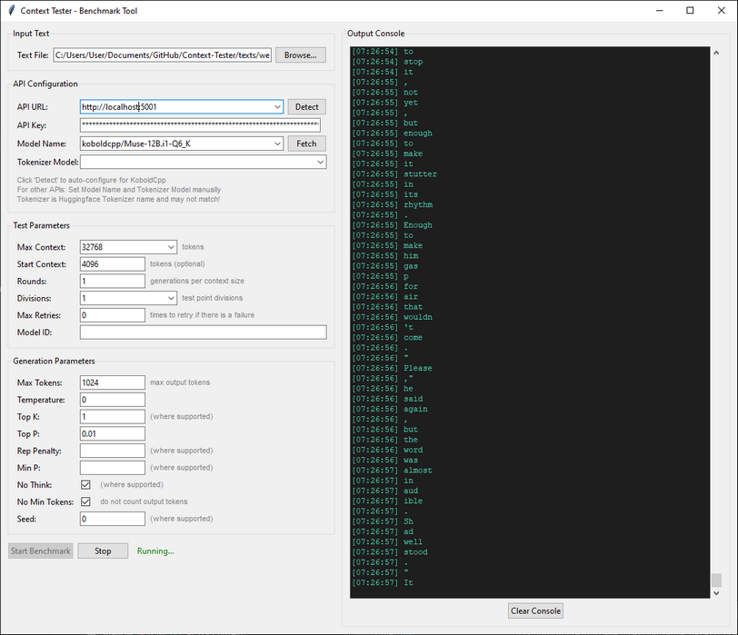
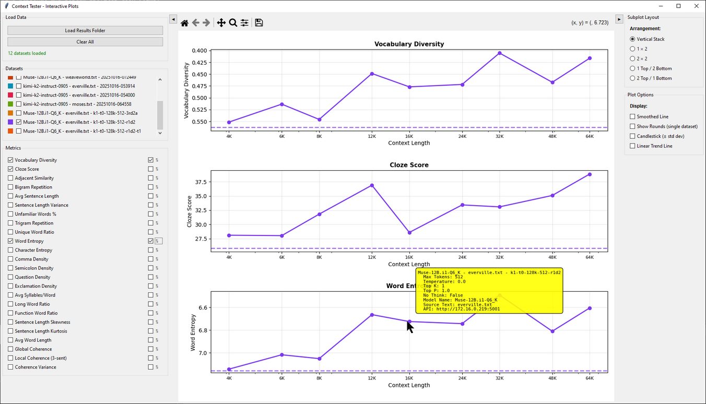

# A Novel LLM Benchmarking Method

The currently LLMs are either subjectively evaluated by humans or LLMs or they are graded on answers to various questions. These methods do are computationally expensive, arbitrary, and are subject to 'training for the test'. 

This tool utilizes a novel method for evaluating an LLM's writing ability using a consistent way to generate creative output across different context windows and parameters.

## How it Works 

A large creative text is used to fill the context window and the model is instructed to continue the text as the original writer. 

A set of standard metrics for evaluating writing is produced from the generated output along with the original text at the point of divergence for the same tokens as the model generated. 

A visualization tool is provided which allows you to compare across generations, models, context windows, test parameters, etc. 

For every set of tests the tool will always give the model the same continuation point in the text. Large windows are filled with tokens starting backwards for the continuation points. 

**Example:** for a set of tests composed of 4096, 8192, and 16384 tokens from a text, the process would be:

- chunk 16384 continuous tokens from somewhere in the text
- the 4096 test will use tokens 12289 through 16384
- the 8192 test will use tokens 8192 through 16384
- the 16384 test will give the whole 16384 chunk to the model

Since we are using the model's tokenizer to create these slices, then tests with the same maximum context on the same model will have a consistent continuation point and can be directly compared.

This of course is not what is actually happening since we are trying to end at natural breaking points and we have to leave enough room for the generation and the instructions, but that is the basic idea.

This process allows the evaluator to test for individual factors which have so far been 'untestable' by any metric. For instance we can test outputs with different RoPE values, with different quantizations, with 16bit, 8bit, and 4bit KV cache, and directly see what impact this has generation. 

## Overview

This repository contains two primary analysis tools:

1. **Context Tester** (`benchmark_gui.py`) - Measures how LLM output quality degrades as context length increases
2. **Performance Comparison Tool** (`plot_gui.py`) - Creates comparison plots from test results

## Installation

### Prerequisites

This tool was specifically designed to use KoboldCpp's and nVidia's OpenAI compatibile API endpoints. It should work with any OpenAI compatible provider with a chat completions and embedding endpoint, but that hasn't been tested.

- Python 3.13 or higher
- A large text to use as the basis for continuation (txt, pdf, or html)
- An OpenAI-compatible API with a chat completion and embedding endpoint

### Setup

Clone the repository:

```bash
git clone https://github.com/jabberjabberjabber/Context-Tester
cd Context-Tester
```

Install UV and sync dependencies:

```bash
pip install uv
uv sync
```

## API Compatibility

The tool works with any OpenAI-compatible API endpoint. Embedding endpoint is required to do coherence tests.

### Tokenizer Support

The system uses a unified tokenizer interface with automatic fallback:

1. **HuggingFace transformers** (primary) - Local tokenization with auto-discovery
2. **KoboldCpp API** (fallback) - Remote tokenization endpoint
3. **Tiktoken** (fallback) - OpenAI tokenization

For gated HuggingFace repositories (like Llama models), set the `HF_TOKEN` environment variable to automatically authenticate.

## Input Text

A text can be any type supported by extractous such as txt, pdf, or html. It can be any formatting but better results are obtained if the paragraphs are separated by a blank line and there is no introduction, index, or any other text in it except the story and chapter headings. If it isn't longer than the maximum context length you test then it will be wrapped around itself.

## Running Tests

```bash
uv run benchmark_gui.py
```


### Results Structure

Tests create a directory in `results/` with the format:

```
results/org-model-text-timestamp/
├── metadata.json                    # Experiment configuration
├── context_2048_results.json        # Results for each context size
├── context_4096_results.json
├── ...
├── degradation_analysis.json        # Statistical analysis
├── model-text-timestamp.csv         # Aggregate data for plotting
├── model-text-timestamp_generations.txt  # All LLM outputs
└── model-text-timestamp.png         # Performance graphs
```

### Interactive Comparisons

```bash
uv run plot_gui.py
```


## Environment Variables

The following environment variables are supported:

**API Keys** (checked in order):
- `API_KEY`
- `API_PASSWORD`
- `OPENAI_API_KEY`
- `NVIDIA_API_KEY`
- `NVAPI_KEY`

**HuggingFace Token**:
- `HF_TOKEN` - For accessing gated models (Llama, etc.)

