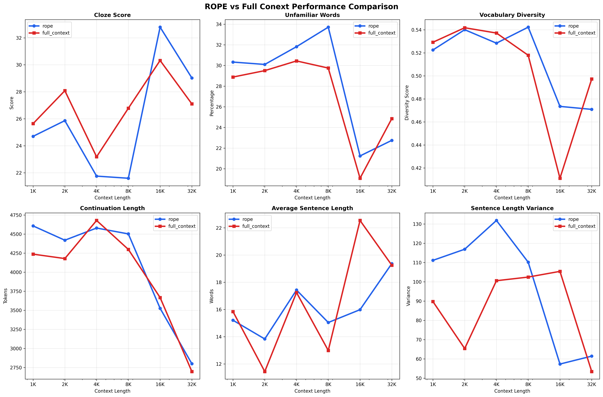

# LLM Analysis Tools

A comprehensive suite for analyzing Large Language Model performance degradation and comparing context handling strategies across different context lengths.

## Overview

This repository contains two primary analysis tools:

1. **Readability Degradation Tester** (`main.py`) - Measures how LLM output quality degrades as context length increases
2. **Performance Comparison Tool** (`generate_plot.py`) - Compares ROPE vs full context configurations across multiple metrics

## Table of Contents

- [Installation](#installation)
- [Quick Start](#quick-start)
- [Tools Overview](#tools-overview)
- [Detailed Usage](#detailed-usage)
- [Understanding the Metrics](#understanding-the-metrics)
- [Output Formats](#output-formats)
- [Examples](#examples)
- [Troubleshooting](#troubleshooting)

## Installation

### Prerequisites

- Python 3.8 or higher
- A running LLM API server (compatible with OpenAI chat completions format)
- Dale-Chall easy words list file (`easy_words.txt`)

### Dependencies

Install required packages:

```bash
pip install pandas matplotlib numpy requests beautifulsoup4 extractous
```

### Dale-Chall Word List

The readability tester requires the Dale-Chall easy words list. Create `easy_words.txt` with one word per line, or download from educational linguistics resources.

## Quick Start

### Testing Readability Degradation

```bash
# Basic test with a novel or long text
python main.py novel.txt --api-url http://localhost:5001

# Multi-round testing for statistical reliability
python main.py document.pdf --rounds 5 --output degradation_results.csv

# Custom context limits
python main.py text.txt --max-context 16384 --rounds 3
```

### Comparing ROPE vs Full Context

```bash
# Generate comparison plots
python generate_plot.py rope_results.csv full_context_results.csv

# Custom output and analysis only
python generate_plot.py rope_data.csv full_context_data.csv --output comparison.png --no-plots
```

## Tools Overview

### Readability Degradation Tester (`main.py`)

**Purpose**: Identifies at what context lengths LLM output quality begins to degrade by measuring readability complexity.

**Key Features**:
- Tests multiple context lengths (powers of 2: 1K, 2K, 4K, 8K, 16K, 32K+)
- Multi-round testing with statistical averaging
- Comprehensive readability analysis using Cloze scores
- Automatic degradation point detection
- Support for any text format via extractous

**Methodology**:
1. Loads reference text and truncates to specific context lengths
2. Generates text continuations via LLM API
3. Analyzes continuation quality using multiple readability metrics
4. Compares quality degradation across increasing context lengths

### Performance Comparison Tool (`generate_plot.py`)

**Purpose**: Visualizes and analyzes performance differences between ROPE and full context configurations.

**Key Features**:
- Comprehensive metric comparison across context lengths
- Statistical analysis and winner identification
- High-quality visualization generation
- Performance range analysis
- Summary insights and recommendations



## Detailed Usage

### Readability Degradation Tester

```bash
python main.py [input_file] [options]
```

**Arguments**:
- `input_file`: Path to reference text (supports PDF, DOCX, TXT, etc.)

**Options**:
- `--api-url`: LLM API endpoint (default: `http://localhost:5001`)
- `--api-password`: API authentication key
- `--word-list`: Path to Dale-Chall word list (default: `easy_words.txt`)
- `--max-context`: Maximum context length to test (auto-detected)
- `--rounds`: Number of test rounds per context length (default: 1)
- `--output`: CSV output file path

**Multi-Round Testing**:
Running multiple rounds per context length provides statistical reliability:
- Reduces impact of generation randomness
- Provides standard deviation metrics
- Enables confidence interval analysis
- Recommended: 3-5 rounds for production analysis

### Performance Comparison Tool

```bash
python generate_plot.py [rope_file] [full_context_file] [options]
```

**Arguments**:
- `rope_file`: CSV file with ROPE configuration results
- `full_context_file`: CSV file with full context configuration results

**Options**:
- `--output`: Output PNG filename (default: `comparison.png`)
- `--no-plots`: Skip plot generation (analysis only)
- `--dpi`: Output image resolution (default: 300)

## Understanding the Metrics

### Readability Metrics

**Cloze Score**: Primary readability indicator
- Range: 10-64 (higher = more readable)
- Formula: `64 - (95 × pct_unfamiliar_words) - (0.69 × avg_sentence_length)`
- Based on Dale-Chall readability research

**Vocabulary Diversity**: `unique_words / total_words`
- Range: 0.0-1.0 (higher = more diverse)
- Measures repetitiveness and word choice variety

**Sentence Length Variance**: Statistical variance of sentence lengths
- Higher values indicate more varied sentence structure
- Lower values suggest repetitive patterns

**Unfamiliar Words Percentage**: Words not in Dale-Chall easy list
- Lower percentages indicate simpler vocabulary
- Sudden increases may signal degradation

### Performance Comparison Metrics

The comparison tool analyzes six key metrics:
- **Cloze Score**: Text readability quality
- **Unfamiliar Words**: Vocabulary complexity
- **Vocabulary Diversity**: Word choice variety  
- **Continuation Length**: Generated text length
- **Average Sentence Length**: Sentence structure consistency
- **Sentence Length Variance**: Structural diversity

## Output Formats

### Readability Test Results

**CSV Output** (when `--output` specified):
- `context_length`: Test context length in tokens
- `cloze_score`: Primary readability score
- `reading_level`: Grade level equivalent
- `pct_unfamiliar_words`: Difficult vocabulary percentage
- `vocabulary_diversity`: Word choice diversity
- `sentence_length_variance`: Structural variety
- Statistical fields (when multi-round): `*_std`, `num_rounds`

**Console Output**:
- Real-time generation progress
- Per-context summary statistics
- Degradation point detection
- Trend analysis and recommendations

### Comparison Tool Results

**Visualization** (PNG file):
- Six-panel comparison charts
- Log-scale context length axis
- Clear metric differentiation
- Professional publication quality

**Console Analysis**:
- Performance winner by context length
- Statistical significance testing
- Context-specific advantages
- Peak performance identification

## Examples

### Example 1: Novel Degradation Analysis

```bash
# Test a novel across multiple context lengths with statistical averaging
python main.py war_and_peace.txt \
    --api-url http://localhost:5001 \
    --rounds 5 \
    --output novel_degradation.csv \
    --max-context 32768
```

Expected output: Detection of quality degradation around 8K-16K context lengths.

### Example 2: Technical Document Testing

```bash
# Test technical documentation with custom word list
python main.py technical_manual.pdf \
    --word-list technical_words.txt \
    --rounds 3 \
    --output tech_analysis.csv
```

### Example 3: ROPE vs Full Context Comparison

```bash
# First, generate data for both configurations
python main.py novel.txt --rounds 5 --output rope_results.csv
# (Switch model to full context configuration)
python main.py novel.txt --rounds 5 --output full_context_results.csv

# Then compare
python generate_plot.py rope_results.csv full_context_results.csv \
    --output model_comparison.png
```

## Troubleshooting

### Common Issues

**"Could not find easy_words.txt"**
- Download Dale-Chall word list or create custom word list
- Ensure file is in working directory or specify path with `--word-list`

**"Token counting API failed"**
- Fallback estimation is used automatically
- Check API endpoint supports `/api/extra/tokencount`
- Verify API server is running and accessible

**"No continuation generated"**
- Check API authentication and endpoint
- Verify model supports chat completions format
- Increase timeout or check server logs

**Empty or short continuations**
- Adjust generation parameters in code
- Check model's maximum output length
- Verify context isn't exceeding model limits

### Performance Optimization

**For Large Documents**:
- Use `--max-context` to limit testing range
- Consider document preprocessing for better text extraction
- Monitor memory usage with very large texts

**For Statistical Reliability**:
- Use 3-5 rounds for production analysis
- More rounds provide better statistics but take longer
- Consider parallel execution for large-scale testing

### API Compatibility

The tools expect OpenAI-compatible chat completions API with these endpoints:
- `POST /v1/chat/completions` - Text generation
- `POST /api/extra/tokencount` - Token counting (optional)
- `GET /api/extra/true_max_context_length` - Context detection (optional)

Compatible with:
- OpenAI API
- Local inference servers (text-generation-webui, vllm, etc.)
- Most commercial LLM APIs with OpenAI compatibility

## Research Applications

These tools are designed for:
- **Model Evaluation**: Comparing different models' context handling
- **Configuration Optimization**: Finding optimal context strategies
- **Quality Assurance**: Detecting degradation in production systems
- **Research**: Understanding attention mechanism limitations
- **Benchmarking**: Standardized quality measurement across models

The readability degradation approach provides objective, reproducible measurements of model performance that correlate with human perception of text quality.
