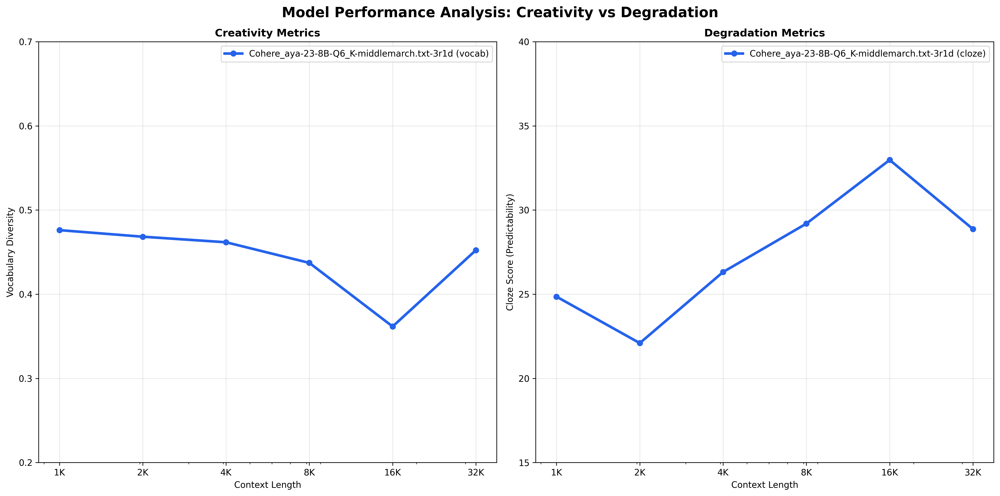
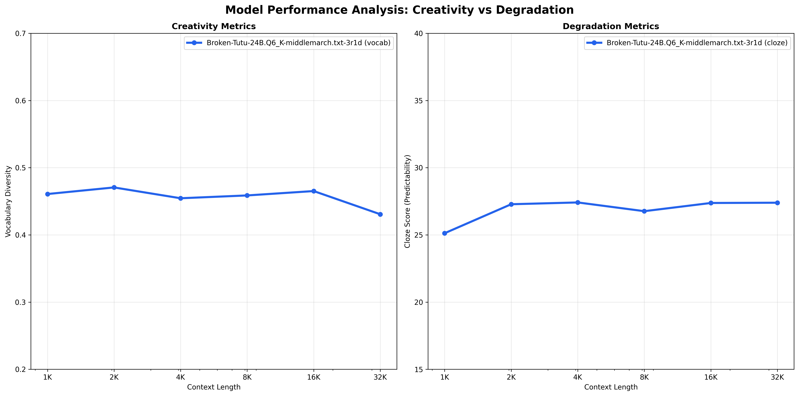
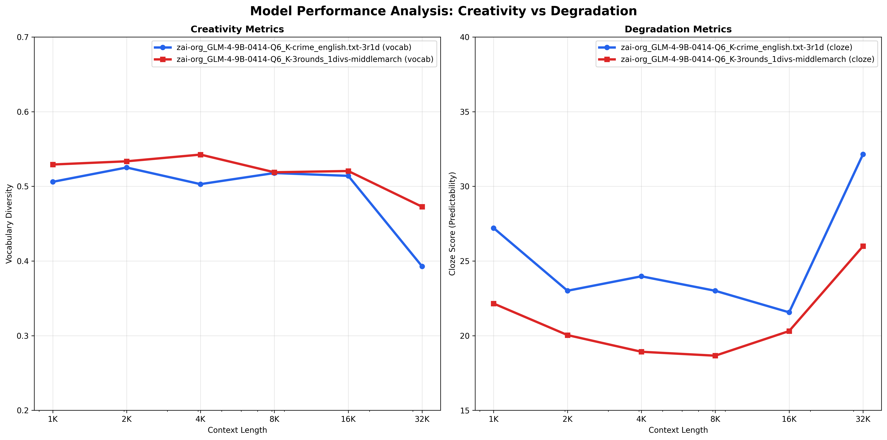

# Context Window Testing

This project utilizes a novel method for evaluating an LLM's ability to utilize different sized context windows.  It is especially concerned with style, creativity and degradation of long form outputs as the amount of tokens fill larger context windows. 

Instead of checking for recall or correctness, the test fills the context with a text and asks the model to continue the text as if it were the original writer. It then evaluates the model's output using basic metrics for readability, sentence length, and vocabulary diversity.

The purpose is not to provide a benchmark that is definitive, but to provide data points for comparison so that one can see how changes to the model weights and processing effects its creative output across different corpus sizes.

Each test using the same parameters with start at the same place in the text each time for the continuation and applies across models. This allows the tests to be repeatable across different sized contexts within the same set of tests as well across different models or fine tune attempts. 

The script finds a natural break point in the text and then cuts out a set of tokens a bit larger than the largest test size. It will then expand the context window by adding new tokens going backwards from the continuation point. In this way the context window can expand with minimal effect on the model's creative choices. Any changes in style or creativity are then assumed to be from the larger number of tokens in the window, and not from stylistic choices due to the text changing. All of these operations are determined by using the actual tokens after converting the text using the model's own tokenizer, which allows for granular slicing of the context windows.
 
## Overview

This repository contains two primary analysis tools:

1. **Readability Tester** (`main.py`) - Measures how LLM output quality degrades as context length increases
2. **Performance Comparison Tool** (`generate_plot.py`) - Plots the data on to two graphs

## Installation

### Prerequisites

- A large text to use as the basis for continuation
- Python 3.8 or higher
- A running KoboldCpp LLM API server

### Dependencies

Clone repo

```
git clone https://github.com/jabberjabberjabber/Context-Tester
cd context-tester
```

Install UV and sync:

```bash
pip install uv
uv sync
```

Ensure you have a running inference instance running a KoboldCpp endpoint that you can connect to. Ensure that you have a properly formatted creative text such as a novel which has at least enough text in it to max out the tokens you are testing for.  

Run data collection:

```
uv run main.py crime_english.txt --api-url http://localhost:5001
```

Wait for the tests to complete. You should now have a csv file and a png file in the directory with the name of the model and the text in it containing the data plots.

If you want to compare data for more than one model, run the test for each model and then use generate_plots to run the comparison using the csv files:

```
uv run generate_plots.py name-of-first-csv-file.csv name-of-second-csv-file.csv 
```
You can put as many as you like and it will plot the data for each of them onto the same graphs.

## Input Text

Texts can be any type supported by extractous such as txt or pdf or html. It can be any formatting but better results are obtained if the paragraphs are separated by 2 blank lines and there is no introduction, index, or any other text in it except the story and chapter headings.
 
## Understanding the Metrics

## Reading the Graphs

This is pretty simple. They should be relatively flat. Any significant move up or down is an indicator of inconsistency.  

The **left-hand** graph goes up when the model outputs more diverse vocabulary, while **right-hand** graph goes up when the model outputs more simple and predictable text.

The below graphs show this effect:



The first plot shows a slight downward slope and then a crash at 16K, while the second one shows an initial lowering of predictability followed by a steady rise. Both plots indicate what looks like a recovery at the end, but this is actually misleading -- when both graphs are taken together you can see that what looks to be an aberrant blip at 16K which immediately rebounds is actually the logical progression as seen by the steady rise of the cloze score on the right. 

Here is a counter example:



This is an ideal result without any large spikes up or down.

Since this test doesn't evaluate coherence, style, accuracy, or instruction following, it should not be used as evidence of model capability. A good result could be achieved by the model generating well-structured, diverse nonsense. 

The test is meant as a starting point and as a simple and easily readable indicator of consistency.

## Text Choice

Here is a comparison of the same model with Crime and Punishment vs Middlemarch:


 
## Detailed Usage

```bash
usage: main.py [-h] [--api-url API_URL] [--api-password API_PASSWORD] [--word-list WORD_LIST] [--max-context MAX_CONTEXT] [--rounds ROUNDS] [--divisions DIVISIONS] [--model-name MODEL_NAME]
               [--max-tokens MAX_TOKENS] [--temp TEMP] [--top-k TOP_K] [--top-p TOP_P] [--min-p MIN_P] [--rep-pen REP_PEN] [--start-context START_CONTEXT]
               input_file

Test LLM readability degradation across context lengths with fixed continuation point

positional arguments:
  input_file            Path to reference text file (any format supported by extractous)

options:
  -h, --help            show this help message and exit
  --api-url API_URL     API URL for the LLM service
  --api-password API_PASSWORD
                        API key/password if required
  --word-list WORD_LIST
                        Path to Dale-Chall easy words list
  --max-context MAX_CONTEXT
                        Maximum context length to test (auto-detect if not specified)
  --rounds ROUNDS       Number of test rounds per context length (default: 3)
  --divisions DIVISIONS
                        Number of context divisions between tiers as a power of 2
  --model-name MODEL_NAME
                        Override model name (auto-detected if not provided)
  --max-tokens MAX_TOKENS
                        Maximum tokens to generate (default: 512)
  --temp TEMP           Generation temperature (default: 1.0)
  --top-k TOP_K         Top-k sampling (default: 100)
  --top-p TOP_P         Top-p sampling (default: 1.0)
  --min-p MIN_P         Min-p sampling (default: 0.1)
  --rep-pen REP_PEN     Repetition penalty (default: 1.01)
  --start-context START_CONTEXT
                        Starting context size in tokens (skip smaller sizes)

Examples:
  python main.py novel.txt --api-url http://localhost:5001
  python main.py document.pdf --max-context 16384 --model-name "MyModel"
  python main.py text.txt --word-list dale_chall_words.txt --rounds 3
  python main.py novel.txt --rounds 5 --divisions 2 --temp 0.8 --top-k 50
  python main.py text.txt --max-tokens 1024 --rep-pen 1.05 --min-p 0.05
  python main.py novel.txt --start-context 8192  # Skip testing small contexts
```

Notes:

**Divisions** allow you to add more data points to the normal span of context windows by adding more continuations in between. For example, you normally have [1024, 2048], etc as data points; setting divisions to be 1 would give you [1024, a, 2048] where 'a' is an equidistant number of tokens between 1024 and 2048. These tokens will always be a power of two and divisions must also be a power of 2.
    
**Rounds** are the number of times a test is repeated at each tier. They are averaged out to mitigate the randomness of LLM generations. At least 3 are recommended.