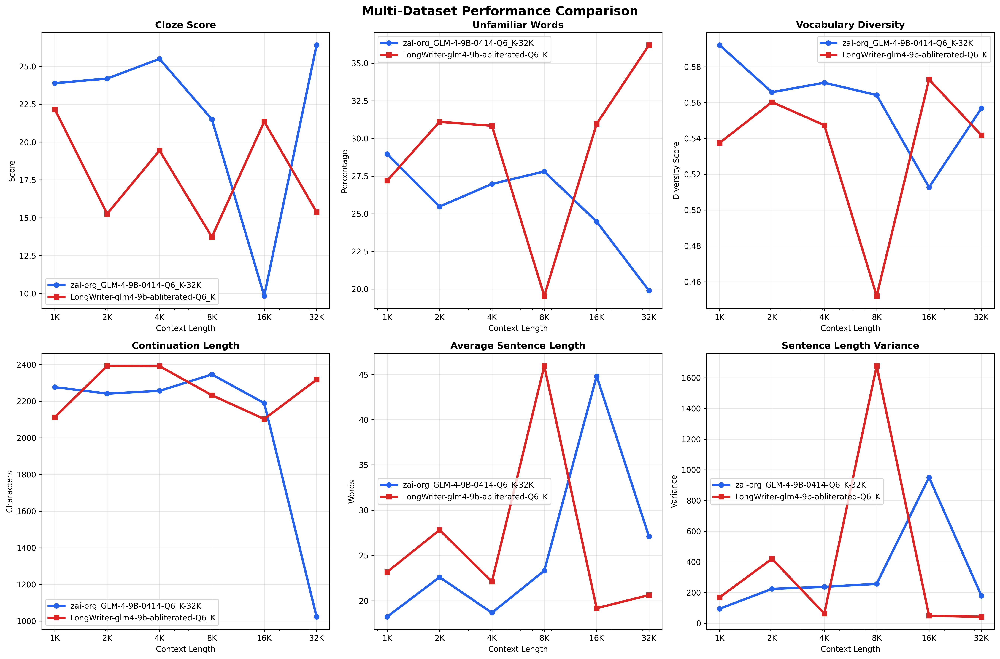

# Context Window Testing

This project utilizes a novel method for evaluated an LLMs ability to utilize different different sized context windows. Instead of checking for recall or correctness, it fills the context with a text and asks the model to continue the text as if it were the original writer. It then evaluates the model's output using basic metrics for readability, including sentence length, estimated grade level, and word variability and complexity.

The purpose is not to provide a benchmark that is definitive, but to provide data points for comparison so that one can see how changes to the model weights and processing effects its creative output across different corpus sizes.

A distinct feature of this test method is the use of a deterministic and static start point for each text and model. Instead of floating through a text going forward by adding tokens to the context window and progressing linearly through the story, the text is pre-tokenized and the largest point in the context window is used as the end of the prompt as sent to the model. The model starts at this spot every time to generate new text, and as tokens are added to increase the context, the earlier parts of the text is used is a reverse linear fashion.

In other words, if we start the test by continuing the story at the beginning of chapter 5, instead of adding tokens and then starting at chapter 6, then chapter 7, and so on, we add chapter 4, then chapter 3, until we reach the beginning. This way we always test from the same origin point. 

## Overview

This repository contains two primary analysis tools:

1. **Readability Degradation Tester** (`main.py`) - Measures how LLM output quality degrades as context length increases
2. **Performance Comparison Tool** (`generate_plot.py`) - Compares ROPE vs full context configurations across multiple metrics

## Table of Contents

- [Installation](#installation)
- [Quick Start](#quick-start)
- [Tools Overview](#tools-overview)
- [Detailed Usage](#detailed-usage)
- [Understanding the Metrics](#understanding-the-metrics)
- [Output Formats](#output-formats)
- [Examples](#examples)
- [Troubleshooting](#troubleshooting)

## Installation

### Prerequisites

- A large text to use as the basis for continuation
- Python 3.8 or higher
- A running LLM API server (compatible with OpenAI chat completions format)

### Dependencies

Install required packages:

```bash
pip install pandas matplotlib numpy requests beautifulsoup4 extractous
```

## Quick Start

### Testing Readability Degradation

```bash
# Basic test with a novel or long text
python main.py novel.txt --api-url http://localhost:5001

# Multi-round testing for statistical reliability
python main.py document.pdf --rounds 5 --output degradation_results.csv

# Custom context limits
python main.py text.txt --max-context 16384 --rounds 3 -divisions 2
```

### Comparing ROPE vs Full Context

```bash
# Generate comparison plots
python generate_plot.py rope_results.csv full_context_results.csv

# Custom output and analysis only
python generate_plot.py rope_data.csv full_context_data.csv --output comparison.png --no-plots
```

## Tools Overview

### Readability Degradation Tester (`main.py`)

**Purpose**: Identifies at what context lengths LLM output quality begins to degrade by measuring readability complexity.

**Key Features**:
- Tests multiple context lengths (powers of 2: 1K, 2K, 4K, 8K, 16K, 32K+)
- Intermediary tiers with divisions
- Multi-round testing with statistical averaging
- Support for any text format via extractous

### Performance Comparison Tool (`generate_plot.py`)

**Key Features**:
- Comprehensive metric comparison across context lengths
- Statistical analysis and winner identification
- High-quality visualization generation
- Performance range analysis
- Summary insights and recommendations

## Detailed Usage

```bash
python main.py [text] [options]
```

**Arguments**:
- `text`: Path to a long creative text that the model can continue any part of (supports PDF, DOCX, TXT, etc.)

**Options**:
- `--api-url`: Koboldcpp API endpoint (default: `http://localhost:5001`)
- `--api-password`: API authentication key
- `--word-list`: Path to Dale-Chall word list (default: `easy_words.txt`)
- `--max-context`: Maximum context length to test (auto-detected)
- `--rounds`: Number of test rounds per context length (default: 3)
- `--divisions`: Split the power of two context tiers into this many parts to create more test datapoints
- `--output`: CSV output file path (required if plotting a graph)

**Multi-Round Testing**:
Running multiple rounds per context length provides statistical reliability:
- Reduces impact of generation randomness
- Provides standard deviation metrics
- Enables confidence interval analysis
- Recommended: 3-15 rounds for production analysis

### Performance Comparison Tool

```bash
python generate_plot.py [csv-file] [csv-file] [...] [options]
```

**Arguments**:
- `csv_file`: Any a CSV file output by the main script containing single datapoints per context window (not the detailed file) 

**Options**:
- `--output`: Output PNG filename (default: `comparison.png`)
- `--no-plots`: Skip plot generation (analysis only)
- `--dpi`: Output image resolution (default: 300)

## Understanding the Metrics

### Readability Metrics

**Cloze Score**: Primary readability indicator
- *LOWER IS BETTER*
- Range: 10-64 (higher = more readable)
- Formula: `64 - (95 × pct_unfamiliar_words) - (0.69 × avg_sentence_length)`
- Based on Dale-Chall readability research

**Vocabulary Diversity**: `unique_words / total_words`
- Range: 0.0-1.0 (higher = more diverse)
- Measures repetitiveness and word choice variety

**Sentence Length Variance**: Statistical variance of sentence lengths
- Higher values indicate more varied sentence structure
- Lower values suggest repetitive patterns

**Unfamiliar Words Percentage**: Words not in Dale-Chall easy list
- Lower percentages indicate simpler vocabulary
- Sudden increases may signal degradation

### Performance Comparison Metrics

The comparison tool analyzes six key metrics:
- **Cloze Score**: Text readability quality
- **Unfamiliar Words**: Vocabulary complexity
- **Vocabulary Diversity**: Word choice variety  
- **Continuation Length**: Generated text length
- **Average Sentence Length**: Sentence structure consistency
- **Sentence Length Variance**: Structural diversity

## Output Formats

### Readability Test Results

**CSV Output** (when `--output` specified):
- `context_length`: Test context length in tokens
- `cloze_score`: Primary readability score
- `reading_level`: Grade level equivalent
- `pct_unfamiliar_words`: Difficult vocabulary percentage
- `vocabulary_diversity`: Word choice diversity
- `sentence_length_variance`: Structural variety
- Statistical fields (when multi-round): `*_std`, `num_rounds`

**Console Output**:
- Real-time generation progress
- Per-context summary statistics
- Degradation point detection
- Trend analysis and recommendations

# Sample Output

## GLM 4 9B-0414-Q6_K-32K

```
[TEST 6/6] Context Length: 32,768 tokens
Running 3 rounds...
--------------------------------------------------
Context built successfully (26501 words)

  Round 1/3:
### Chapter XXIII: The Mischief in the Sierra Morena

Don Quixote found himself in the midst of the Sierra Morena, a rugged and desolate region where the air was thick with the echoes of distant battles and the whispers of forgotten legends. It was there that Sancho Panza and Don Quixote endured one of their most trying ordeals. The landscape was barren, the air was cold, and the silence was only broken by the occasional caw of a raven or the distant roar of a waterfall. Sancho trudged through the snow-covered terrain, weighed down by his master's delusions and their dwindling supplies. Together, they faced the harsh reality of the sierra, where the wind howled with icy fury and the ground beneath their feet was treacherous.

As night fell, the two companions found a sheltered spot among the craggy peaks, and Sancho's heart pounded with fear. The sky was darkening, and the cold air sent chills through his bones. He clutched his blanket tightly, realizing that this was no ordinary adventure but a desperate struggle for survival. Don Quixote, though wearied by his own chivalric fantasies, felt a spark of determination ignited by the challenge before him. Together, they faced the cold with a mixture of bravado and terror, their spirits bolstered by the ridiculous grandeur of their shared delusions.

The next day, as the first light of dawn pierced through the dense fog, Sancho and Don Quixote found themselves confronted with the daunting task of crossing a narrow gorge, a path riddled with hidden dangers and steep cliffs. The landscape was treacherous, with loose stones and shifting sand creating a perilous obstacle course. Every step forward seemed to threaten not only their lives but also their sanity. Yet, driven by the relentless pursuit of their chivalric dreams, they pressed on, their steps echoing through the silent forest, their hearts filled with a dangerous mix of hope and despair.

As the day wore on, they stumbled upon a small cave nestled deep within a towering rock. It was there, in the shadow of the cave, that Sancho and Don Quixote finally came to a halt. They had arrived at a critical juncture, where the line between reality and illusion blurred into an indistinguishable mess. Sancho's practical sense clashed violently with Don Quixote's fantastical world, setting the stage for one of the most intense and perilous encounters in their shared
    Cloze:  14.66, Level:    16+, Vocab: 0.564

  Round 2/3:
### The Unyielding Knight of the Sierra

Don Quixote de la Mancha stood firm amidst the rocky expanse of the Sierra Morena, his chest heaving with exertion as he wiped sweat from his brow with the back of his hand. The air was thick with the scent of pine and sage, and the mountains loomed large on the horizon, their rugged peaks piercing the sky. His armor, once gleaming with the promise of chivalric glory, now appeared dull and tarnished under the harsh sunlight. He was clad in ancient, ill-fitting armor that barely covered his gaunt frame, its once-bright colors long since faded by time and the elements.

Rocinante, the faithful steed that bore the knight, stood beside him, his hooves digging into the soft earth as if seeking some invisible foothold. Sancho Panza, the faithful squire, watched from a distance, a mixture of concern and apprehension on his face as he observed Don Quixote’s labours. The sun was high in the sky, casting long shadows across the barren landscape, and the day promised to be as arduous as any they had faced before.

The silence was broken only by the distant call of a hawk soaring high above the treeline, its cry echoing through the mountains. Don Quixote stood still for a moment, his eyes fixed on the distant bird, his mind momentarily far away in the realm of chivalric fantasies. But reality soon called him back to the present, and he felt the weight of his responsibilities and the challenges that lay ahead.

Around him, the ground was strewn with debris and remnants of battles long past, as if the echoes of history still lingered in the very stones. Yet, it was here, in this desolate place, that Don Quixote found himself once more at the crossroads of his extraordinary journey. The road before him was fraught with danger and uncertainty, but it also held the promise of adventure and the pursuit of his noble cause.

As the knight and his squire made their way deeper into the heart of the Sierra Morena, the landscape grew even wilder and more formidable. The rugged terrain seemed almost alive, a testament to the untamed spirit of the wilderness that surrounded them. And it was here, in the midst of this vast and unforgiving landscape, that Don Quixote's true nature would be put to the test.

### The Burdened Squire

Sancho Panza, the ever-f
    Cloze:  17.23, Level:  13-15, Vocab: 0.553

  Round 3/3:
### Chapter Twenty-Three: The Battle at the Sierra Morena

Don Quixote found himself in the midst of a fierce battle as his enemy, Gines de Pasamonte, advanced with his troops. The air was thick with the sound of clashing swords and the cries of dying men. Amidst the chaos, Don Quixote's horse, Rocinante, struggled to stand against the onslaught. Sancho Panza, wielding his lance, fought valiantly beside his master, their determination unwavering despite the overwhelming odds. The battlefield became a scene of desolation, littered with fallen heroes and broken weapons. In the heat of the battle, Sancho and Don Quixote were separated, leaving the latter to confront Gines alone. Wasting no time, Gines charged at Don Quixote with a fierce scream, aiming to strike the knight-errant down. However, Don Quixote managed to deflect the blow with his sword, turning the attack into a display of unparalleled chivalry.

Despite the initial success, the battle took a dire turn for Don Quixote. The force of Gines' attack sent him tumbling to the ground, clutching his wounds. Around him, the battlefield lay in ruins, littered with the dead and dying. Sancho Panza, though battered and bruised, stood firm, watching as his, was now a mere shadow of his former self. The battlefield, with its echoes of war and the cries of the wounded, set the stage for the darkest chapter in Don Quixote's quest for glory.

### The Stripping of Don Quixote

As Gines de Pasamonte watched the knight-errant struggle to rise, he saw his chance. With a fierce cry, Gines charged at Don Quixote, aiming to strike a decisive blow. But this time, Don Quixote was ready. Drawing his sword with a swift motion, he parried Gines' attack, sending the man staggering backward. The shock of the failed strike reverberated through the battlefield, and the onlookers held their breath in anticipation. Don Quixote stood poised, ready to defend himself against the onslaught of Gines and his followers.

Gines, stunned by the knight's unexpected prowess, hesitated. The scene unfolded with rapid intensity; the clash of steel
    Cloze:  14.24, Level:    16+, Vocab: 0.508

Averaged Results (n=3):
  Cloze Score:  15.38 (±1.62)
  Reading Level:  13-15
  Unfamiliar Words:  36.2%
  Avg Sentence Length:  20.6
  Sentence Variance:  43.2
  Vocabulary Diversity: 0.542 (±0.030)

============================================================
DEGRADATION ANALYSIS
(Based on averages of 3 rounds each)
✅ All continuations from SAME story position
============================================================

Cloze Score Trend:
  Starting:  22.16
  Ending:    15.38
  Change:    -6.79 (more complex text)

Vocabulary Diversity Trend:
  Starting:  0.537
  Ending:    0.542
  Change:   +0.004 (more diverse)

⚠️ DEGRADATION DETECTED:
  At 4,096 tokens: cloze_score rose 4.180
  At 4,096 tokens: sentence_variance dropped 357.075
  At 8,192 tokens: vocabulary_diversity dropped 0.095
  At 16,384 tokens: cloze_score rose 7.617
  At 16,384 tokens: sentence_variance dropped 1627.707
  At 32,768 tokens: sentence_variance dropped 6.680

FULL RESULTS:
 Context    Cloze   ±Std    Level Unfamiliar  AvgSent Variance VocabDiv   ±Std
--------------------------------------------------------------------------------
   1,024    22.16   2.53    11-12      27.2%     23.2    169.7    0.537  0.041
   2,048    15.26   4.97    13-15      31.1%     27.8    421.1    0.560  0.013
   4,096    19.44   4.12    13-15      30.8%     22.1     64.0    0.547  0.032
   8,192    13.73   5.16      16+      19.6%     45.9   1677.6    0.452  0.057
  16,384    21.35  14.39    11-12      31.0%     19.2     49.9    0.573  0.022
  32,768    15.38   1.62    13-15      36.2%     20.6     43.2    0.542  0.030

📊 Averaged results saved to: LongWriter-glm4-9b-abliterated-Q6_K.csv
📊 Detailed round-by-round results saved to: LongWriter-glm4-9b-abliterated-Q6_K_detailed.csv
```


## LongWriter-glm4-9b-abliterated-Q6_K

```  
[TEST 6/6] Context Length: 32,768 tokens
Running 3 rounds...
--------------------------------------------------
Context built successfully (26498 words)

  Round 1/3:
Starting from: aid to the curate in
The curate and the barber were both curious to see what the youth was doing. They had been following him, and he had been left alone. The curate, who had been talking to himself, was no sooner heard the youth raise his head and wipe his feet with a towel he had taken from under the montera. As he wiped his face, the goatherd and barber returned to where they had concealed themselves, and they all gathered around the youth who sat, still contemplating his feet, which were now covered in white cloth, looking like pieces of alabaster. He was a youth in the habit of a peasant, who had taken off his montera and gaiters, and now stood in the shade, contemplating his feet. And as Sancho’s letter, which the curate had been carrying, began to tremble in his heart, he was not able to bear the thought of having lost Dulcinea, who had rejected his love for his sake.
    Cloze:  26.60, Level:  11-12, Vocab: 0.540

  Round 2/3:
Starting from: aid to the curate in
Seeing himself served in this way, Don Quixote said to his squire, “I have always heard it said, Sancho, that to do good to boors is to throw water into the sea. If I had believed thy words, I should have avoided this trouble; but it is done now, it is only to have patience and take warning for the future.” Sancho followed suit, and after they had finished his farewells, they took leave of each other, each of which was confident that when he had seen him do so. The curate and barber returned thanks to them for their services, and told them to be careful on the journey, “for there is great danger in this part of the road, and it may be that we shall never see him again.” With these words they took leave of each other, and went on their different ways, each of them with more sorrow and regret; for they had reason to fear the time that was approaching of which they thought he was come to an end in so great a manner and to know more of his misfortunes, which made his memory and his grief.”
    Cloze:  20.04, Level:  13-15, Vocab: 0.580

  Round 3/3:
Starting from: aid to the curate in
Don Quixote, Sancho, the curate, and the barber made their way down the mountain, not knowing where they were going, “for they had got into such a fright that I am now.” Sancho’s heart was still full of trouble and grief for his master, and his own loss, though he tried to keep it well, as if to be as indifferent as possible. The curate and the barber had long since lost interest in what they had heard of Don Quixote’s madness, for they had a mind to get her out of the Sierra, as they had a great curiosity to see him suffer.” “I am not mad,” he said; “as I am not.” Sancho had told me so?” “I have a great mind to do so.” And as he went on the broomsticks they set the letter at the head of an old and very large cork tree. And Sancho Panza went his way. Don Quixote had no mind to go mad or not, for he found a place that was so good a tree; for there he found a large chest in his hands as if to give thanks for his own good fortune. And as he went along he could swear that every time he had been wanting in something that was very necessary to live.” “You are well?” said the curate. “I am well enough,” answered Sancho. “Then let us go.” “I am not afraid of this.” And so saying they went along.
    Cloze:  32.58, Level:   9-10, Vocab: 0.551

Averaged Results (n=3):
  Cloze Score:  26.41 (±6.27)
  Reading Level:  11-12
  Unfamiliar Words:  19.9%
  Avg Sentence Length:  27.1
  Sentence Variance: 180.4
  Vocabulary Diversity: 0.557 (±0.020)

============================================================
DEGRADATION ANALYSIS
(Based on averages of 3 rounds each)
✅ All continuations from SAME story position
============================================================

Cloze Score Trend:
  Starting:  23.89
  Ending:    26.41
  Change:    +2.51 (simpler text)

Vocabulary Diversity Trend:
  Starting:  0.592
  Ending:    0.557
  Change:   -0.035 (more repetitive)

⚠️ DEGRADATION DETECTED:
  At 16,384 tokens: vocabulary_diversity dropped 0.051
  At 32,768 tokens: cloze_score rose 16.567
  At 32,768 tokens: sentence_variance dropped 770.800

FULL RESULTS:
 Context    Cloze   ±Std    Level Unfamiliar  AvgSent Variance VocabDiv   ±Std
--------------------------------------------------------------------------------
   1,024    23.89   5.32    11-12      29.0%     18.2     95.4    0.592  0.040
   2,048    24.19   1.76    11-12      25.5%     22.6    224.8    0.566  0.022
   4,096    25.50   2.05    11-12      27.0%     18.7    238.1    0.571  0.012
   8,192    21.50   0.66    11-12      27.8%     23.3    257.3    0.564  0.036
  16,384     9.84  19.32      16+      24.5%     44.8    951.2    0.513  0.078
  32,768    26.41   6.27    11-12      19.9%     27.1    180.4    0.557  0.020

📊 Averaged results saved to: zai-org_GLM-4-9B-0414-Q6_K-32K.csv
📊 Detailed round-by-round results saved to: zai-org_GLM-4-9B-0414-Q6_K-32K_detailed.csv
```


